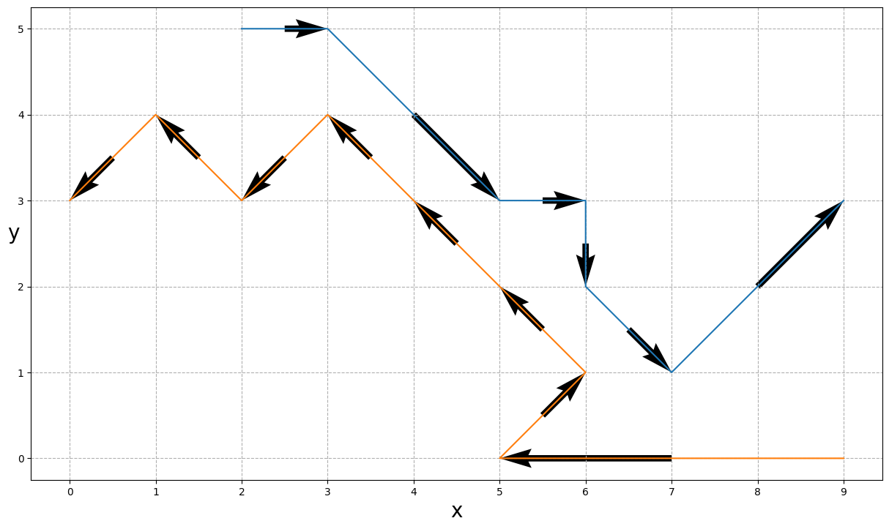
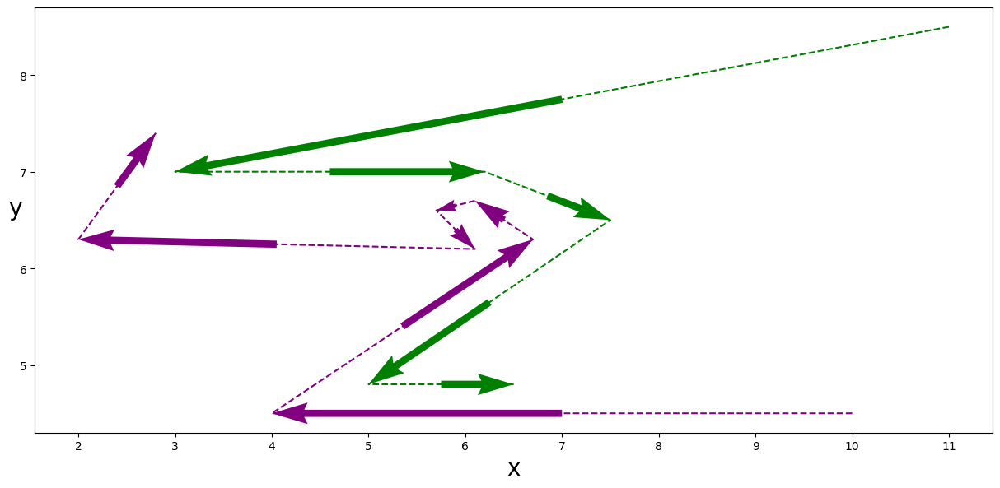

# quiver-comp

Comparing discrete paths

- Initial line/quiver plot in `quiver.py` sketches the problem:

- This suggests that a distance function to compare only the tangent vectors at the points
  nearby to one or more points on the alternate path would give a way to compare directions.

- However, we also want to consider real world paths which are not so simple, for instance
  ones that loop back on themselves to momentarily head in the same direction as the
  alternate path (though the alternate paths are overall in opposite directions)

